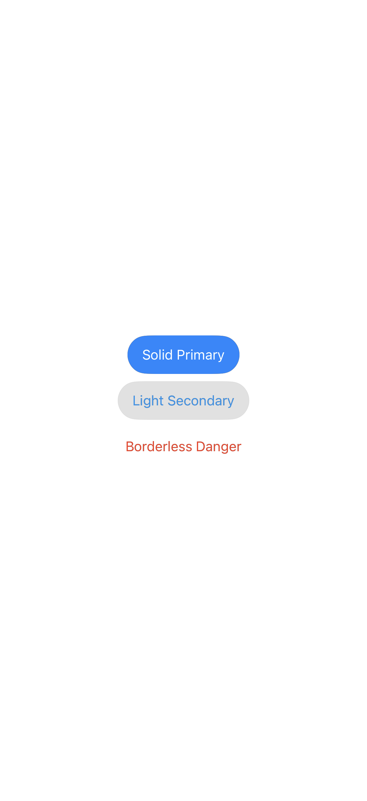
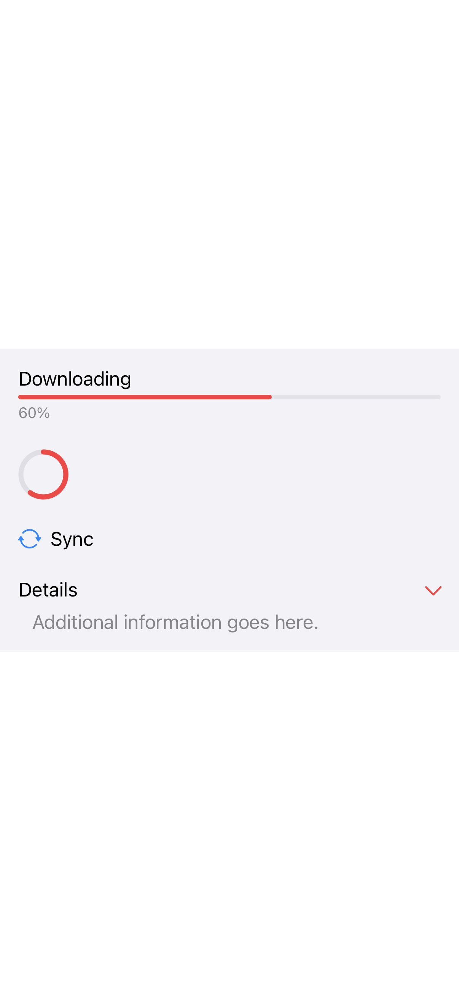
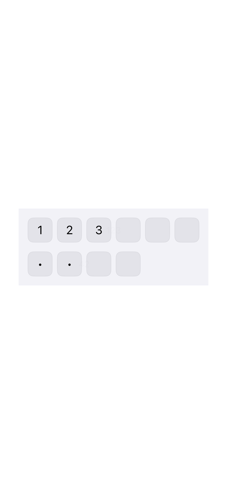
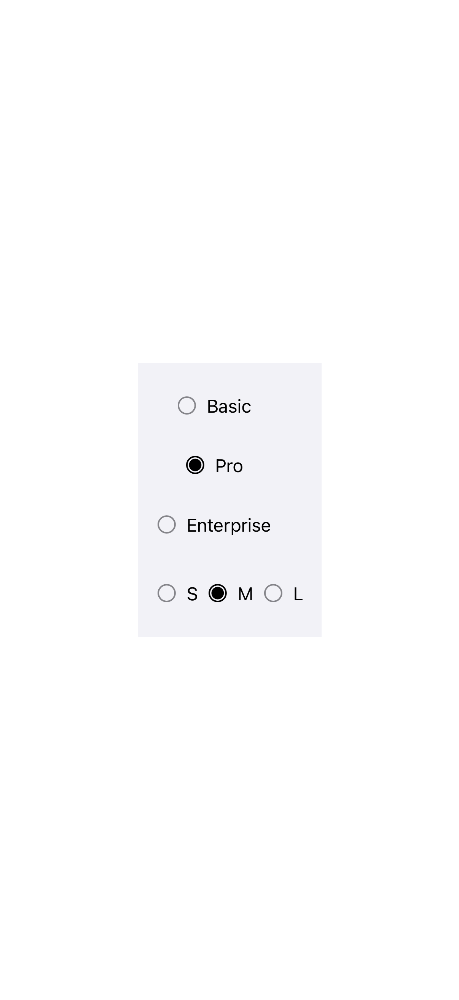
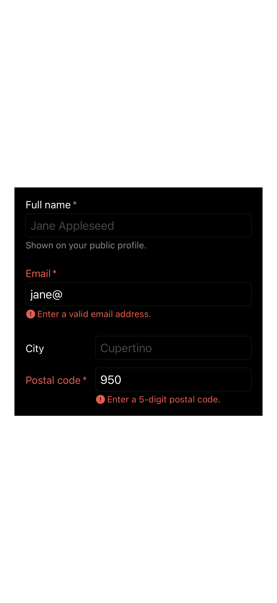
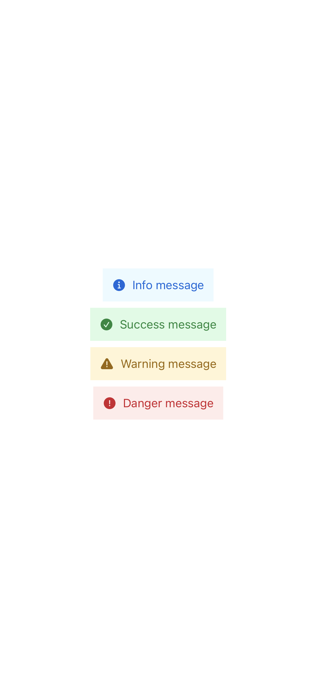
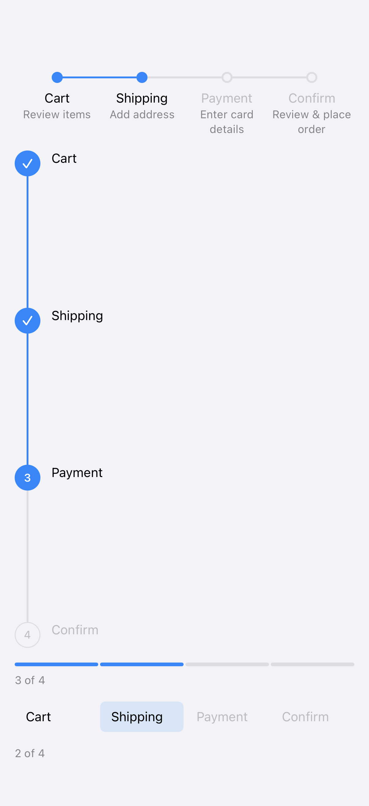
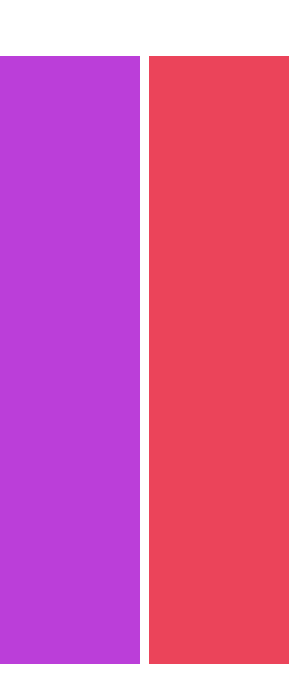
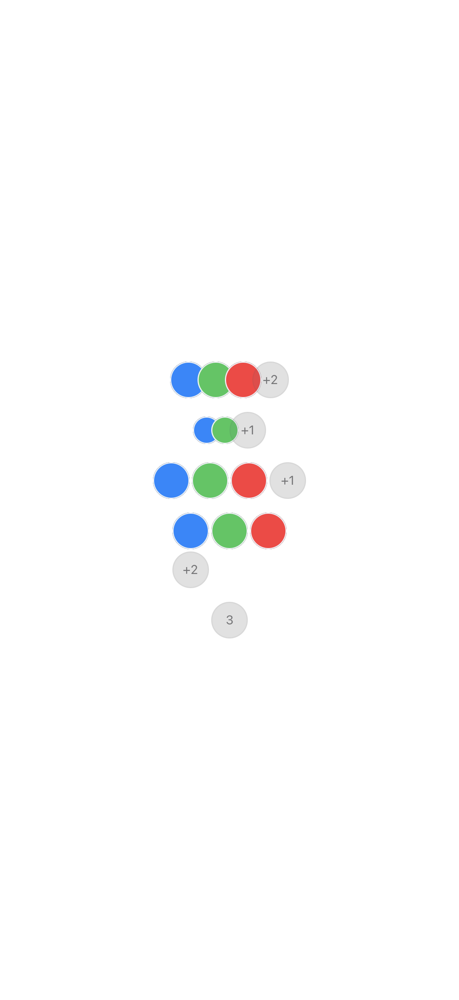
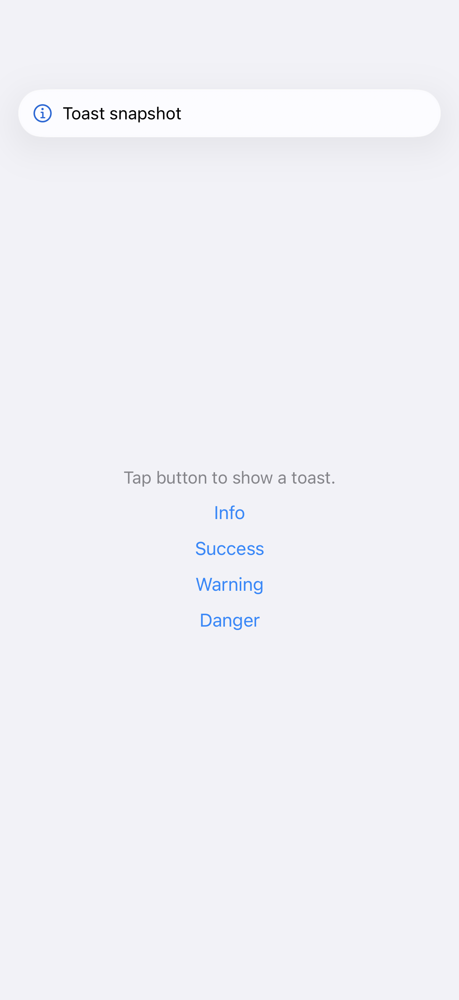

# OhMyDesign 组件库 / Component Library

iOS 26+ / macOS 26+ SwiftUI 设计系统，含 33 个 Apple HIG 对齐组件（其中 `ProgressBar` 自 `0.6.0` 起弃用）+ 4 个系统控件 `.core` style（ProgressView `.core` / `.coreCircular` / Label / DisclosureGroup；`LabeledContent` 的 `.core` 随 [Descriptions](components/descriptions.md) 列出）+ 2 个按压反馈 ButtonStyle + 1 个加载遮罩 modifier（`View.spinning(_:text:)`）。另有锚定徽标 modifier [`View.anchoredBadge(_:placement:hostShape:)`](components/anchored-badge.md)（无独立的 public View 组件类型——只有 `AnchoredBadgeContent` 等入参枚举——不进下方索引表）。

自 `#245` 起本包有**三个 product**：主 target `OhMyDesign`（下面的组件索引）、
表达性视觉层 `OhMyDesignEffects`、图表层 `OhMyDesignCharts`。
后两者的 40 个 API 单位索引在文末的
[动效与图表索引 / Effects & Charts Index](#动效与图表索引--effects--charts-index)。

> 新增或改造组件前先读 [`component-contract.md`](component-contract.md)——
> 判定法、样式扩展点、配置开关的替代路径。

## 组件索引 / Component Index

### Button 按钮

| 组件 | 预览 | 文档 |
|---|---|---|
| Button |  | [button.md](components/button.md) |
| FloatButton（ExtendedFloatButtonStyle / CircularGlassButtonStyle） |  | [float-button.md](components/float-button.md) |
| Pressable Button Styles（PressableRowButtonStyle / PressableCardButtonStyle） |  | [pressable-button-styles.md](components/pressable-button-styles.md) |
| SlideToConfirm |  | [slide-to-confirm.md](components/slide-to-confirm.md) |

### Form 表单

| 组件 | 预览 | 文档 |
|---|---|---|
| SegmentedControl |  | [segmented-control.md](components/segmented-control.md) |
| SearchField |  | [search-field.md](components/search-field.md) |
| LabelIcon / ChevronRightIcon / DangerIcon |  | [form-icons.md](components/form-icons.md) |
| `.core` Control Styles（ProgressView `.core` / `.coreCircular` / Label / DisclosureGroup）|  | [core-control-styles.md](components/core-control-styles.md) |
| Rating |  | [rating.md](components/rating.md) |
| RatingDisplay |  | [rating-display.md](components/rating-display.md) |
| PinCode |  | [pin-code.md](components/pin-code.md) |
| RadioGroup / RadioOption |  | [radio.md](components/radio.md) |
| TagInput |  | [tag-input.md](components/tag-input.md) |
| FormField |  | [form-field.md](components/form-field.md) |
| TagGroup |  | [tag-group.md](components/tag-group.md) |
| ~~Typography~~ | _未实现，parity 已由 `.coreFont(_:)` + 原生 `Text` modifier 达成_ | [typography.md](components/typography.md)（墓碑 + 迁移指引） |

### Indicator 指示器

| 组件 | 预览 | 文档 |
|---|---|---|
| Badge |  | [badge.md](components/badge.md) |
| Tag |  | [tag.md](components/tag.md) |
| Banner |  | [banner.md](components/banner.md) |
| StateLabel |  | [state-label.md](components/state-label.md) |
| ProgressIndicator（含 `text:` 文案 init） |  | [progress-indicator.md](components/progress-indicator.md) |
| ~~ProgressBar~~（`0.6.0` 起弃用） | _改用 `ProgressView().progressViewStyle(.core)`_ | [progress-bar.md](components/progress-bar.md)（弃用 + 迁移指引） |
| Skeleton（SkeletonLine / SkeletonRect / SkeletonCircle） |  | [skeleton.md](components/skeleton.md) |
| Steps |  | [steps.md](components/steps.md) |
| Timeline |  | [timeline.md](components/timeline.md) |

### Layout 布局

| 组件 | 预览 | 文档 |
|---|---|---|
| Avatar |  | [avatar.md](components/avatar.md) |
| AvatarGroup |  | [avatar-group.md](components/avatar-group.md) |
| ListRow |  | [list-row.md](components/list-row.md) |
| FlowLayout |  | [flow-layout.md](components/flow-layout.md) |
| Carousel |  | [carousel.md](components/carousel.md) |

### Container 容器（Phase 2 · `0.4.0`）

| 组件 | 预览 | 文档 |
|---|---|---|
| Card |  | [card.md](components/card.md) |
| Separator |  | [separator.md](components/separator.md) |
| SectionHeader / SectionFooter |  | [section-header-footer.md](components/section-header-footer.md) |
| InsetGroupedSection |  | [inset-grouped-section.md](components/inset-grouped-section.md) |
| SettingsRow |  | [settings-row.md](components/settings-row.md) |
| Descriptions |  | [descriptions.md](components/descriptions.md) |

### Navigation 导航

| 组件 | 预览 | 文档 |
|---|---|---|
| UnderlinedTabBar |  | [underlined-tab-bar.md](components/underlined-tab-bar.md) |

### Feedback 反馈

| 组件 | 预览 | 文档 |
|---|---|---|
| Toast |  | [toast.md](components/toast.md) |
| ~~EmptyState~~ | _已于 #97 移除 — 改用 SwiftUI [`ContentUnavailableView`](https://developer.apple.com/documentation/swiftui/contentunavailableview)_ | [empty-state.md](components/empty-state.md)（墓碑 + 迁移指引） |
| spinning（`View.spinning(_:text:)` modifier） |  | [spinning.md](components/spinning.md) |

## 生成预览图 / Generating Snapshots

运行 `scripts/run-snapshots.sh` 重新生成所有已收录 `#Preview` 宏的组件 PNG 预览图，输出到 `docs/snapshots/`。

Run `scripts/run-snapshots.sh` to regenerate preview PNGs for all components with `#Preview` macros, output to `docs/snapshots/`.

## 动效与图表索引 / Effects & Charts Index

`OhMyDesignEffects`（36 个）与 `OhMyDesignCharts`（4 个）的 API 单位。由
`shipswift-effects` epic（#242）落地，逐单位说明见各自的 `components/*.md`。

> ⚠️ **落点说明（`#256` 原文 → `#270` 改写）**：`#256` 当时写的是「本节刻意不在
> 『## 组件索引』之内，因为这 40 个单位不是登记条目，写进去会让
> `readmeIndexReconcilesWithRegistry` 当场判红；扫描根仍是单根 `Sources/OhMyDesign`、
> 登记表仍是 `ohmydesign` 47 条」。**那个前提已由 `#270` 兑现并作废**：
> 扫描根已扩成 `GuardScanRoots.allRoots`（三个 target），两个新 target 里的 15 个
> `public struct: View`（Effects 11 + Charts 4）已按判定法登记，`ohmydesign` 侧由 47 变 62。
>
> ⚠️ **本节仍保持独立小节，但已进入判据的定义域**：`readmeIndexRows` 的解析范围
> `#270` 起是**两段**——`## 组件索引 → ## 生成预览图` 与
> `## 动效与图表索引 → ## NFR-1 帧率基准`。⇒ 本节每一行的行名都必须能落进
> 登记表 / `entryPoints` / styleImpls / 墓碑 / 排除等桶，落空即红。
> 保留分节的理由是 AD-4《下游连锁三》自己写的那句「每行仍须带模块名……
> 那是**可读性要求**」——按 `import` 分组正是可读性的那一侧；
> 而 AD-4「三个 target 全部进主索引」的**论据**是解析范围止于 `## 生成预览图`
> 这条工程事实，`#270` 直接把那条事实改掉了，规范目的（每个登记条目都被索引行覆盖）不变。

> ⚠️ **本节没有预览图**：这 40 个单位的 `#Preview` 都住在库内源文件里，而提交态的快照
> 只收宿主 `App/Sources/Previews.swift` 驱动的产物（产地规则见
> `scripts/run-snapshots.sh` 与 `Tests/OhMyDesignTests/SnapshotArtifactGuard.swift`）。
> 它们的评审面是**可交互的画廊**：`./scripts/run-preview.sh`，侧栏 `Effect` / `Chart` 两组。

### 微交互 / Micro-interactions（`import OhMyDesignEffects`）

| 单位 | 入口 | 文档 |
|---|---|---|
| shake | `View.shake(trigger:strength:)` | [shake.md](components/shake.md) |
| jump | `View.jump(trigger:strength:)` | [jump.md](components/jump.md) |
| spin | `View.spin(trigger:direction:)` | [spin.md](components/spin.md) |
| ping | `View.ping(trigger:strength:color:)` | [ping.md](components/ping.md) |
| spray | `View.spray(trigger:symbol:strength:colors:)` | [spray.md](components/spray.md) |
| rise | `View.rise(trigger:text:strength:color:)` | [rise.md](components/rise.md) |
| haptic | `View.haptic(_:trigger:)` | [haptic.md](components/haptic.md) |
| shine | `View.shine(trigger:highlight:)` | [shine.md](components/shine.md) |

### 转场 / Transitions（16 种）

| 单位 | 入口 | 文档 |
|---|---|---|
| blur | `.transition(.blur)` / `.blur(radius:)` | [blur-transition.md](components/blur-transition.md) |
| filmExposure | `.transition(.filmExposure)` / `.filmExposure(intensity:)` | [film-exposure-transition.md](components/film-exposure-transition.md) |
| snapshot | `.transition(.snapshot)` / `.snapshot(intensity:)` | [snapshot-transition.md](components/snapshot-transition.md) |
| flicker | `.transition(.flicker)` / `.flicker(cycles:)` | [flicker-transition.md](components/flicker-transition.md) |
| flip | `.transition(.flip)` / `.flip(axis:)` | [flip-transition.md](components/flip-transition.md) |
| rotate3D | `.transition(.rotate3D)` / `.rotate3D(angle:axis:)` | [rotate3d-transition.md](components/rotate3d-transition.md) |
| swoosh | `.transition(.swoosh)` / `.swoosh(edge:travel:)` | [swoosh-transition.md](components/swoosh-transition.md) |
| boing | `.transition(.boing)` / `.boing(strength:)` | [boing-transition.md](components/boing-transition.md) |
| skid | `.transition(.skid)` / `.skid(edge:travel:)` | [skid-transition.md](components/skid-transition.md) |
| move（极坐标） | `.transition(.move)` / `.move(angle:distance:)` | [move-transition.md](components/move-transition.md) |
| iris / wipe / blinds / clock / glare / dissolve | `.transition(.iris)` … 六种各有无参与含参两个入口 | [mask-reveal-transitions.md](components/mask-reveal-transitions.md) |

> ⚠️ `.move` 与 SwiftUI 自带的 `.move(edge:)` 是**重载**而不是覆盖（本仓的类型叫
> `PolarMoveTransition`，不叫 `MoveTransition`）。这条契约由
> `scripts/downstream-probe/Sources/DownstreamProbe/TransitionClusterProbe.swift` 守，
> 库内守不住 —— 理由见该文件。
> 3D 与弹性那一簇（flip / rotate3D / swoosh / boing / skid / move）另有一份合并说明：
> [transition-cluster-3d-elastic.md](components/transition-cluster-3d-elastic.md)。
>
> ⚠️ **`particle` 按入口是转场，但它归在下面的「文本与展示」组里数**（PR #294 终审 S-4）。
> 上一版把它**同时**列进本表与「文本与展示」⇒ 本表标题写「16 种」而实际列了 17 个单位，
> 且与 `ACKNOWLEDGEMENTS.md`《逐单位归档》的分组（转场 16 / 文本与展示 4，
> `ParticleTransition` 在后者）对不上。而「36 + 4 = 40」这个算术在本 epic 里是承重的
> ——两处重复计一个单位会把 40 变成 41。⇒ 以归档表为准，本表只列 16 种。

### 庆祝与处理中 / Celebration & processing

| 单位 | 入口 | 文档 |
|---|---|---|
| Confetti | `View.confetti(trigger:strength:colors:)` | [confetti.md](components/confetti.md) |
| ScanningOverlay | `ScanningOverlay { }` | [scanning-overlay.md](components/scanning-overlay.md) |
| GlowSweep | `GlowSweep { }` | [glow-sweep.md](components/glow-sweep.md) |
| LightSweep | `LightSweep { }` | [light-sweep.md](components/light-sweep.md) |

### 文本与展示 / Text & display

| 单位 | 入口 | 文档 |
|---|---|---|
| TypewriterText | `TypewriterText(_:speed:)` / `TypewriterText(verbatim:speed:)` | [typewriter-text.md](components/typewriter-text.md) |
| AnimatedMeshGradient | `AnimatedMeshGradient(colors:alternateColors:)` | [animated-mesh-gradient.md](components/animated-mesh-gradient.md) |
| BeforeAfterSlider | `BeforeAfterSlider(labels:layout:before:after:)` | [before-after-slider.md](components/before-after-slider.md) |
| ParticleTransition | `.transition(.particle)` / `.particle(count:colors:)` | [particle-transition.md](components/particle-transition.md) |

### 跨平台改造 / Cross-platform rewrites（AD-E）

| 单位 | 入口 | 文档 |
|---|---|---|
| OrbitingLogos | `OrbitingLogos(_:colors:rotationPeriod:layout:logo:center:)` | [orbiting-logos.md](components/orbiting-logos.md) |
| DotSphere | `DotSphere(count:colors:rotationPeriod:)` | [dot-sphere.md](components/dot-sphere.md) |
| CharSphere | `CharSphere(_:count:colors:rotationPeriod:)` | [char-sphere.md](components/char-sphere.md) |
| FullScreenButton | `FullScreenButton(destination:label:)` | [full-screen-button.md](components/full-screen-button.md) |

### 图表 / Charts（`import OhMyDesignCharts`）

| 单位 | 入口 | 文档 |
|---|---|---|
| RadarChart | `RadarChart(_:title:tint:layout:)` | [radar-chart.md](components/radar-chart.md) |
| RingChart | `RingChart(_:goal:title:tint:colors:layout:)` | [ring-chart.md](components/ring-chart.md) |
| ActivityHeatmap | `ActivityHeatmap(_:title:tint:calendar:layout:)` | [activity-heatmap.md](components/activity-heatmap.md) |
| NetworkGraph | `NetworkGraph(nodes:edges:title:tint:layout:)` | [network-graph.md](components/network-graph.md) |

## NFR-1 帧率基准 / Frame-rate benchmark

`./scripts/run-perf-benchmark.sh` 把 Confetti（默认粒子数）与 NetworkGraph（声明的节点 /
边上限）放进**真实运行的 App** 里，用 `CADisplayLink` 采样帧间隔并按「掉帧率 ≤ 5%」判定。
第一条腿是**对照组**（每帧主线程死等 40 ms），它必须被判为掉帧 —— 否则这把秤是坏的。

每条 `[perf]` 行带三样必须连带看的读数（PR #294 终审 C-1 / C-2 / I-1）：

- `bodyEvaluations=` / `drawnFrames=` —— 被测对象在窗口内**真的干了活**的次数。
  低于下限直接判红。⚠️ 它存在的理由是一次实测：上一版把 `.confetti(trigger:)` 删掉、
  把 NetworkGraph 宿主换成 `Color.clear`，同一个脚本**照样三条全 PASS**。
- `budget=` / `threshold=` —— **运行时实测**的帧预算与门槛（取 `CADisplayLink.duration`），
  不再写死 1/60。
- `graph-input: … uniqueUndirected=` —— NetworkGraph 那条腿真的喂进了 600 条**不重复的
  无向边**（`NetworkGraph` 按无向去重且先于一切进行；上一版的生成式在 mod 150 下
  实际只有 147 条唯一边）。输入退化会在开跑之前判红。

⚠️ **Simulator 上跑绿不构成 NFR-1 达标证据**（PRD 钉的是「iPhone 15 满帧」，
Simulator 没有真实 GPU 调度）。真机跑法见脚本头部注释。
⚠️ **截至 `#256` 合入，真机那一次尚未执行。**
⚠️ **本脚本不在任何 CI 腿里**（`App/` 整个不在 CI 里，见 `.github/workflows/ci.yml`）
—— 上面那类回归只能靠有人手跑它才会被发现。

## 运行演示应用 / Running the Preview App

运行 `scripts/run-preview.sh` 在模拟器中构建并启动 OhMyDesignPreview 应用。

Run `scripts/run-preview.sh` to build and launch the OhMyDesignPreview app in the Simulator.
